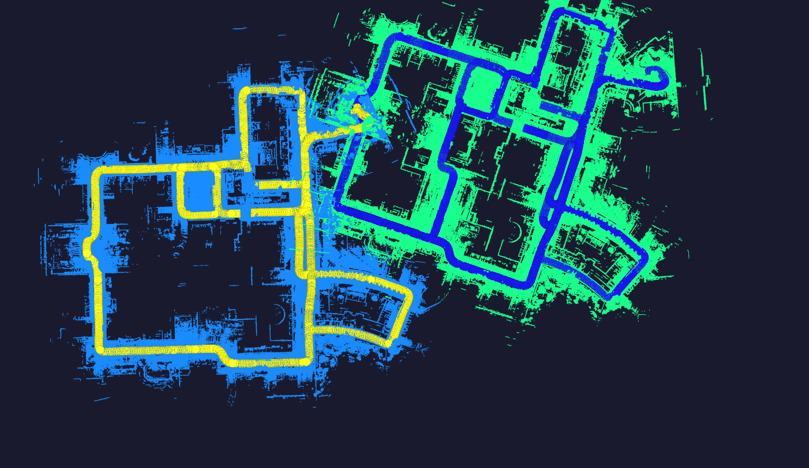
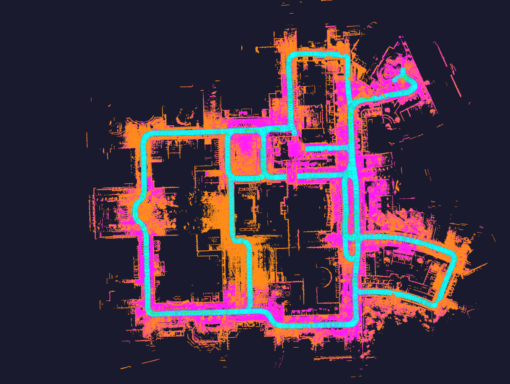

# long_term_mapping

**Multi-Session LiDAR SLAM for Long-Term Map Maintenance**

> A ROS2 C++ package that merges independently-acquired LiDAR sessions, detects structural changes between sessions, and produces a unified map with positive/negative change maps. The implementation is inspired by the concepts in the [LT-mapper paper](https://ieeexplore.ieee.org/abstract/document/9811916/) and re-implemented from scratch for ROS2 Jazzy.

| Before (single-session maps) | After (merged & change-detected) |
|---|---|
|  |  |

---

## Table of Contents

- [Overview](#overview)
- [System Architecture](#system-architecture)
- [Input Data Format](#input-data-format)
- [Dependencies](#dependencies)
- [Build](#build)
- [Configuration](#configuration)
- [Running](#running)
- [Published Topics](#published-topics)
- [Output Files](#output-files)
- [Algorithm Details](#algorithm-details)
- [Acknowledgements](#acknowledgements)
- [Citation](#citation)
- [License](#license)

---

## Overview

`long_term_mapping` takes two independently-recorded LiDAR sessions (each with its own pose-graph and keyframe scans) and performs:

1. **Inter-session place recognition** using [SOLiD](https://github.com/sparolab/solid) descriptors
2. **Multi-session pose-graph optimization** via GTSAM iSAM2 with anchor-node-based loop factors
3. **Geometric scan matching** using NanoGICP with DOP (Dilution of Precision)-based outlier rejection
4. **Map change detection** — tile-based set-difference analysis identifying:
   - **ND (Negative Difference)**: points that disappeared between sessions
   - **PD (Positive Difference)**: newly appearing structures
5. **Curved Voxel Clustering** for dynamic object segmentation from the change maps
6. **Unified map export** — merged point cloud, per-session PD/ND maps, and updated pose files

```
Session 1 (directory1/)          Session 2 (directory2/)
  ├── Scans/  (*.pcd)               ├── Scans/  (*.pcd)
  ├── StaticMap.pcd                 ├── StaticMap.pcd
  ├── optimized_poses.txt           ├── optimized_poses.txt
  └── edges.txt                     └── edges.txt
              │                              │
              └──────────┬───────────────────┘
                         ▼
              long_term_mapping node
                         │
           ┌─────────────┼─────────────┐
           ▼             ▼             ▼
     Merged map     ND / PD maps   Updated poses
```

---

## System Architecture

```
main()
 ├── setParams()            — load YAML parameters
 ├── getDirectory()         — resolve I/O paths
 ├── loadFiles()            — read poses & edges from both sessions
 ├── initNoises()           — initialise GTSAM noise models
 ├── getEdges()             — build intra-session odometry factors
 ├── placeRecognition()     — SOLiD-based inter-session loop detection
 ├── getLoopEdges()         — KISS-Matcher global registration + NanoGICP loop edges
 ├── getPoses()             — add anchor-node prior/loop factors
 ├── runISAM2opt()          — iSAM2 pose-graph optimization + updatePoses()
 ├── generateOptimizedMap() — assemble merged PCD maps
 ├── MapUpdate()            — tile-based ND/PD change detection
 └── saveEdges()            — write merged edge file
```

### Key Components

| Component | Role |
|---|---|
| **KISS-Matcher** | Global point cloud registration to compute initial inter-session transform |
| **SOLiDModule** | Rotation-invariant global descriptor for inter-session loop candidates |
| **NanoGICP** | Fast generalized ICP for 6-DOF relative pose estimation |
| **GTSAM iSAM2** | Incremental Bayesian pose-graph optimizer |
| **DOP filter** | Dilution-of-Precision metric to reject geometrically degenerate loop/change detections |

---

## Input Data Format

Each session directory must follow this structure (compatible with the output of [Pose_Graph_Optimization](https://github.com/Kimkyuwon/Pose_Graph_Optimization)):

```
<session_dir>/
├── Scans/
│   ├── 0.pcd              ← full keyframe scan
│   ├── 0_ground.pcd       ← ground points only
│   ├── 0_nonground.pcd    ← non-ground points
│   ├── 1.pcd
│   └── ...
├── StaticMap.pcd          ← merged static point cloud map (required for KISS-Matcher)
├── optimized_poses.txt    ← one line per keyframe:
│                              timestamp tx ty tz qx qy qz qw
└── edges.txt              ← one line per edge:
                               from_idx to_idx tx ty tz roll pitch yaw σ0…σ5
```

**`optimized_poses.txt` line format:**
```
<timestamp> <x> <y> <z> <qx> <qy> <qz> <qw>
```

**`edges.txt` line format:**
```
<from_idx> <to_idx> <tx> <ty> <tz> <roll> <pitch> <yaw> <σ0> <σ1> <σ2> <σ3> <σ4> <σ5>
```

---

## Dependencies

### System Libraries
| Library | Purpose | Install |
|---|---|---|
| [PCL](https://pointclouds.org/) ≥ 1.12 | Point cloud processing | `sudo apt install libpcl-dev` |
| [Eigen3](https://eigen.tuxfamily.org/) ≥ 3.4 | Linear algebra | `sudo apt install libeigen3-dev` |
| [GTSAM](https://gtsam.org/) ≥ 4.1 | Pose-graph optimization | see below |
| OpenMP | Parallelization | `sudo apt install libomp-dev` |
| [flann](https://github.com/flann-lib/flann) | Approximate nearest neighbours (KISS-Matcher) | `sudo apt install libflann-dev` |
| [lz4](https://github.com/lz4/lz4) | Compression (KISS-Matcher) | `sudo apt install liblz4-dev` |
| [oneTBB](https://github.com/oneapi-src/oneTBB) | Parallelism (KISS-Matcher) | `sudo apt install libtbb-dev` |

### Bundled Third-party Libraries (no separate install)
| Library | Purpose | Notes |
|---|---|---|
| [KISS-Matcher](https://github.com/MIT-SPARK/KISS-Matcher) | Global point cloud registration | Source bundled in `include/kiss_matcher/` |

### Third-party ROS2 Packages (source build)
| Package | Notes |
|---|---|
| [nano_gicp](https://github.com/engcang/nano_gicp) | Fast GICP implementation |
| [SOLiD](https://github.com/sparolab/solid) | Place recognition descriptor |
| [fast_lio2_mapping_and_localization](https://github.com/Kimkyuwon/fast_lio2_mapping_and_localization) | LiDAR-Inertial odometry / keyframe producer |
| [Pose_Graph_Optimization](https://github.com/Kimkyuwon/Pose_Graph_Optimization) | Single-session pose-graph optimization & keyframe export |

### GTSAM Installation
```bash
sudo add-apt-repository ppa:borglab/gtsam-release-4.1
sudo apt update
sudo apt install libgtsam-dev libgtsam-unstable-dev
```

---

## Build

### 1. Install system dependencies

```bash
# Core build tools & SLAM libraries
sudo apt install libeigen3-dev libpcl-dev libomp-dev

# KISS-Matcher dependencies (bundled source, needs these system libs)
sudo apt install libflann-dev liblz4-dev libtbb-dev

# GTSAM
sudo add-apt-repository ppa:borglab/gtsam-release-4.1
sudo apt update
sudo apt install libgtsam-dev libgtsam-unstable-dev
```

### 2. Clone and build

```bash
# Clone into workspace
cd ~/your_workspace/src
git clone https://github.com/Kimkyuwon/long_term_mapping.git

# Install ROS2 package dependencies
cd ~/your_workspace
rosdep install --from-paths src --ignore-src -r -y

# Build
# Note: On the first build, CMake will automatically download ROBIN
#       (KISS-Matcher dependency) from the internet. Internet access required once.
colcon build --packages-select long_term_mapping --cmake-args -DCMAKE_BUILD_TYPE=Release

# Source workspace
source install/setup.bash
```

> **Note**: `include/kiss_matcher/` is bundled in this repository.  
> No separate KISS-Matcher installation is required.  
> ROBIN is fetched automatically by CMake on the first build and cached for subsequent builds.

---

## Configuration

Edit `config/params.yaml` before launching:

```yaml
/**:
  ros__parameters:
    # ── Input session directories ──────────────────────────────────────────
    directory1: /path/to/session1          # Central (reference) session
    directory2: /path/to/session2          # Query (new) session
    output_directory: output               # Relative to package root
    blind: 2.0                             # Ignore returns within this radius [m]

    # ── KISS-Matcher (inter-session global registration) ───────────────────
    anchor_resolution: 2.0                 # Voxel resolution for KISS-Matcher [m]

    # ── SOLiD place recognition & pose-graph ───────────────────────────────
    r_solid_thres: 0.95                    # SOLiD similarity threshold (↑ = stricter)
    fov_u:  22.5                           # LiDAR vertical FoV upper bound [deg]
    fov_d: -22.5                           # LiDAR vertical FoV lower bound [deg]
    num_angle: 120                         # SOLiD azimuth bins
    num_range: 50                          # SOLiD range bins
    num_height: 32                         # SOLiD height bins
    min_distance: 1                        # Minimum descriptor search range [m]
    max_distance: 50                       # Maximum descriptor search range [m]
    voxel_size: 0.4                        # Voxel leaf size for maps [m]
    num_exclude_recent: 0                  # Exclude N most-recent frames from search
    num_candidates_from_tree: 20           # Top-K candidates per query
    dop_thres: 1.3                         # DOP ratio rejection threshold

    # ── Void-evidence / persistence (change detection) ─────────────────────
    persistence.res: 0.2                   # Evidence voxel size [m]
    persistence.r0: 15.0                   # Range-decay onset for q_dist [m]
    persistence.r_s: 20.0                  # Range-decay scale for q_dist [m]
    persistence.d_surf: 0.5                # Grazing-angle weighting band near the surface [m]
    persistence.aniso_typ: 0.3             # Direction-diversity reference (see below)
    persistence.eps_reg: 0.001             # (legacy, unused) 3D vDOP regularization
    persistence.vdop_typ: 1.5              # (legacy, unused) 3D vDOP normalizer
    persistence.sigma_vdop: 1.0            # (legacy, unused) 3D vDOP falloff
    persistence.n_req: 3.0                 # Required effective observation mass
    persistence.w_min: 0.05                # Weight floor
    persistence.n_sat: 5.0                 # Correlated-observation saturation (see below)
    persistence.l_hit: 0.85                # Log-odds increment per effective hit
    persistence.l_void: 0.4                # Log-odds decrement per effective void observation
    persistence.l_max: 5.0                 # Log-odds clamp (binds once void and hit compete)
    persistence.tau_del: 0.3               # p < tau_del -> disappeared (ND)
    persistence.tau_add: 0.7               # p > tau_add -> newly appeared (PD)
    persistence.cross_dilate: 1            # Neighbor-tolerant cross query radius [voxel], 0 = off
    persistence.dilate_weight: 0.5         # Attenuation applied to neighbor-inherited evidence
    persistence.cluster_eps: 0.5           # ND/PD connected-component radius [m]
    persistence.min_cluster_size: 11       # Drop ND/PD components smaller than this, <=1 = off
```

#### Direction diversity: `aniso_typ`

Void evidence for a voxel is accumulated as `M = Σ qᵢ·uᵢuᵢᵀ` over the ray directions `uᵢ` that
passed through it. A ground robot drives along a planar path, so the rays reaching a given voxel
lie almost entirely in one plane and the smallest eigenvalue `λ₃` is physically always near zero.
Any metric that depends on `λ₃` — including the 3D vDOP formerly used here — therefore carries no
information and saturates on its regularizer.

Direction diversity is instead measured inside the observable plane, as the spread of `λ₂` relative
to `λ₁` on the trace-normalized matrix:

```
aniso  = λ₂ / λ₁            (0 = rays along a single line, 1 = isotropic within the plane)
w_geom = clamp(aniso / aniso_typ, 0, 1)
```

For rays spread uniformly over a half-fan of `±θ` in the plane, `aniso = (1-s)/(1+s)` with
`s = sin(2θ)/(2θ)`, so `aniso_typ` has a direct geometric reading: `0.2 → ±42.9°`,
`0.3 → ±51.7°`, `0.5 → ±65.3°` earns full weight. The default `0.3` is a **provisional value
derived from this geometry, not from measured data**; re-tune it against the
`aniso histogram (lambda_2/lambda_1)` diagnostic printed at run time. `eps_reg`, `vdop_typ` and
`sigma_vdop` are kept only so the legacy vDOP can still be logged alongside the new metric for
comparison.

#### Evidence competition and `n_sat`

`SEEN_FREE` and `REFLECTION` are independent UFOMap layers, so a single voxel can be observed both
as free space and as occupied by the opposite session. Both observations are accumulated into the
same log-odds value and allowed to compete; a voxel is labelled unexplored (UE) only when neither
kind of evidence exists:

```
# pers_1 — "the session-1 structure is still there"
if (n_hit  > 0)  log_odds += l_hit  * effectiveCount(n_hit,  n_sat)
if (is_void)     log_odds -= w_v * l_void * effectiveCount(n_void, n_sat)

# pers_2 — "the session-2 structure is new"   (exact sign mirror of pers_1)
if (n_hit  > 0)  log_odds -= l_hit  * effectiveCount(n_hit,  n_sat)
if (is_void)     log_odds += w_v * l_void * effectiveCount(n_void, n_sat)

log_odds = clamp(log_odds, ±l_max)
UE  <=>  !(n_hit > 0) && !is_void      # and no neighbor evidence, see cross_dilate below
```

Void evidence carries the same coefficient `l_void` in both directions, at the center query and on
the neighbor-inherited path alike, so ND and PD sit at the same effective threshold: a pure-void
voxel needs `w_v > |logit(tau)| / (l_void · n_sat) = 0.4236` in either direction. The `PD
coefficient` log line prints both thresholds and flags them if they ever diverge.

Repeated observations of one voxel across consecutive keyframes are strongly correlated, so counting
them linearly overstates the evidence by an order of magnitude (a slowly traversed corridor yields
`n_keyframes` in the tens). `effectiveCount` converts a raw count into an effective number of
independent observations:

```
effectiveCount(n, n_sat) = n_sat · (1 − exp(−n / n_sat))     # → n as n→0, → n_sat as n→∞
```

`n_sat` therefore caps the magnitude of either evidence type and sets the decision threshold
directly. For a pure-void voxel, ND requires `w_v · l_void · n_sat > |logit(tau_del)| = 0.8473`; at
`n_sat = 5` and `l_void = 0.4` this becomes `w_v > 0.424`, which is what puts the void weight `w_v`
back in control of the decision. Lower `n_sat` makes the detector more conservative (fewer ND/PD),
higher `n_sat` more aggressive. Tune it against the `ND/PD yield`, `Decision margin` and
`Void voxel w_v distribution` diagnostics printed at run time.

#### Neighbor-tolerant cross query: `cross_dilate`, `dilate_weight`

The two session maps are voxel-downsampled at `voxel_size` (0.4 m) before classification, while the
decision grid runs at `persistence.res` (0.2 m), and map insertion adds a one-voxel unknown shell
around every surface (`inflate_unknown = 1`). All three effects share the same scale, so two
sessions that observed the *same* physical surface can land in adjacent cells of the decision grid.
A voxel that finds neither hit nor free evidence at its own coordinate is then reported as UE even
though the opposite session did observe the surface — measurement showed 40–48 % of all UE voxels
have a hit in their 26-neighborhood.

When the center query finds nothing and `cross_dilate > 0`, the query is widened to the
`(2·cross_dilate+1)³ − 1` neighborhood and the state is inherited from there:

```
center miss  ->  probe neighbors within cross_dilate
   any neighbor with hits > 0   ->  inherit hit evidence  (max hits over the neighborhood)
   else any neighbor seenFree   ->  inherit void evidence (n_void from the *center* voxel entry)
   else                         ->  still UE
inherited term is multiplied by dilate_weight
```

Three invariants hold by construction:

* **Center first.** The neighborhood is probed only when the center yielded no evidence at all, so
  every voxel that was decided before is decided identically now.
* **Hit first.** Hit evidence outranks free evidence, matching the observation that misalignment
  pushes surfaces sideways far more often than it opens free space (`adj_free_only` is ~0.3 % of UE).
* **Attenuation.** Inherited evidence is positional inference, not observation, so `dilate_weight`
  keeps it strictly weaker than a center observation.

`cross_dilate: 0` disables the feature and reproduces the center-only behaviour bit-for-bit, which
makes it the A/B baseline. UE voxels are still never removed from the composed final map. Tune
against `Dilate resolution`, `UE reduction`, `Dilated evidence outcome` and
`UE 26-neighbor state (after dilate)`.

#### Connected-component post-filter: `cluster_eps`, `min_cluster_size`

Residual registration error between the two sessions produces "shell" false positives: a thin,
misaligned copy of a surface the *opposite* session also observed. Genuine change occupies space
the opposite session left empty, so the two are separable by how far a detection sits from the
opposite session's point cloud — and that distance grows with cluster size. Measured on the current
dataset (ND 12301 pts, PD 11283 pts):

| component size | ND median dist. to SecondMap | PD median dist. to FirstMap |
|---|---|---|
| 1 | 0.175 m | 0.135 m |
| 2–10 | 0.167–0.220 m | 0.098–0.126 m |
| 11–30 | 0.444 m | 0.110 m |
| 31–100 | 0.547 m | 0.277 m |
| 101–300 | 0.578 m | 0.408 m |

89 % of single-point ND detections lie within 0.5 m of a session-2 surface; the separation jumps at
11 points. After `classifyChanges()` and **before** the debug PCDs are written and
`composeFinalMap()` runs, connected components of the ND and PD clouds are computed at radius
`cluster_eps` and components smaller than `min_cluster_size` are dropped, so `ND.pcd`, `PD.pcd` and
`StaticMap.pcd` all reflect the same decision.

`cluster_eps` is governed by the actual point spacing, not by `persistence.res`: the input maps are
downsampled at `voxel_size` (0.4 m), giving a nearest-neighbour distance of 0.27 m (median) and
0.38 m (p75). A radius of 0.35 m severs more than a quarter of the legitimate neighbour links and
shatters real objects (the largest ND component collapses from 654 to 81 points), so 0.5 m is the
correct connection radius here. Re-derive it from the point spacing if `voxel_size` changes.

Survival is decided per voxel, not per point — if any point of a voxel belongs to a surviving
component the whole voxel and all of its points are kept — which preserves the invariant that the
cloud contains exactly the points of the voxel set. `composeFinalMap()` reads only `nd_voxels` and
the debug PCD is written from `nd_cloud`, so the two must never disagree.

`min_cluster_size: 1` (or 0) disables filtering entirely and reproduces the previous behaviour
bit-for-bit — the cluster statistics are still computed and logged, but neither the voxel sets nor
the clouds are touched. UE sets are never filtered. Tune against `Cluster size histogram` and
`Cluster filter`; lower the threshold toward 6 if small real objects (posts, signs, pedestrians) are
being lost, raise it toward 31 if shell-shaped detections survive.

---

## Running

### Launch 

```bash
ros2 launch long_term_mapping lt_mapper.launch.py 
```

### Expected Console Output

```
=== Parameters loaded ===
directory1: /data/Campus1
directory2: /data/Campus2
output_directory: Merged
[LTmapping] Session Edge Loading Complete.
[LTmapping] Place Recognition Complete.
[LTmapping] Loop Edge Generation Complete. size : 42
[LTmapping] Pose Factor loading Complete.
[LTmapping] Graph Optimization Complete.
[LTmapping] Map Merging Complete.
[LTmapping] Map Update Complete.
[LTmapping] Long Term SLAM Complete.
[LTmapping] Completion message published.
```

---

## Published Topics

| Topic | Type | Description |
|---|---|---|
| `/first_kf_node` | `sensor_msgs/PointCloud2` | Session 1 keyframe positions |
| `/second_kf_node` | `sensor_msgs/PointCloud2` | Session 2 keyframe positions |
| `/merge_kf_node` | `sensor_msgs/PointCloud2` | Merged keyframe positions |
| `/First_path` | `nav_msgs/Path` | Session 1 optimized trajectory |
| `/Second_path` | `nav_msgs/Path` | Session 2 optimized trajectory |
| `/Merge_path` | `nav_msgs/Path` | Combined trajectory |
| `/Merge_map` | `sensor_msgs/PointCloud2` | Full merged point cloud map |
| `/loopLine` | `visualization_msgs/Marker` | Inter-session loop constraint visualization |
| `/lt_mapping_complete` | `std_msgs/Bool` | Published `true` upon completion |

---

## Output Files

All outputs are written to `<package_root>/<output_directory>/`:

```
<output_directory>/
├── FirstMap.pcd              ← Session 1 full map (optimized poses)
├── FirstGroundMap.pcd        ← Session 1 ground points
├── FirstNonGroundMap.pcd     ← Session 1 non-ground points
├── SecondMap.pcd             ← Session 2 full map
├── SecondGroundMap.pcd
├── SecondNonGroundMap.pcd
├── optimized_poses.txt       ← Merged pose list (same format as input)
├── edges.txt                 ← Merged edge list
├── Scans/                    ← Re-indexed keyframe PCD files
│   ├── 0.pcd, 0_ground.pcd, 0_nonground.pcd
│   └── ...
└── Debug/
    ├── KissMatchedMap.pcd    ← Session 1 + 2 maps aligned by KISS-Matcher (intensity-coded per session)
    ├── ND.pcd                ← Negative-difference (disappeared) points
    ├── PD.pcd                ← Positive-difference (appeared) points
    ├── FirstUE.pcd           ← Session 1 unexplored area (UE) points
    └── SecondUE.pcd          ← Session 2 unexplored area (UE) points
```

The `Debug/ND.pcd` and `Debug/PD.pcd` files can be fed into a downstream change-management module (e.g., static map construction, dynamic object removal).

---

## Algorithm Details

### 1. Global Alignment & Anchor-node Pose-graph Optimization

#### 1-1. Why global alignment first?

Each session builds its own local map from an arbitrary starting pose, so their coordinate frames are unrelated. GTSAM's iSAM2 is a **nonlinear** optimizer that linearizes the cost function around the current estimate at every iteration. If Session 2 nodes are initialized far from their true positions in Session 1's frame, two failure modes occur:

1. **Linearization error** — the Jacobian computed at a wrong operating point points in the wrong direction, causing divergence or convergence to a bad local minimum.
2. **Cauchy kernel saturation** — loop closure edges use a Cauchy robust kernel (parameter = 1.0). When the residual of a loop edge greatly exceeds the Cauchy threshold, the kernel saturates and the edge's effective weight drops to near zero. Even with many correct inter-session loops, the optimizer treats them all as outliers and ignores them.

#### 1-2. Initial inter-session transform via KISS-Matcher 

Before any keyframe-level loop detection, **KISS-Matcher** registers the two full static maps to compute a 6-DOF rigid body transform that maps Session 2's coordinate frame into Session 1's world frame, providing the initial estimate for all Session 2 nodes and placing them close enough to their true positions for iSAM2 to converge reliably.

| Parameter | Description |
|---|---|
| `anchor_resolution` | Voxel downsampling resolution for KISS-Matcher [m]. Larger values are faster but less accurate. Typical range: 1.0–3.0 m |

The two maps, aligned by the resulting transform and colour-coded by session (intensity `1` = Session 1, `2` = Session 2), are saved to `Debug/KissMatchedMap.pcd` so the global registration quality can be inspected before pose-graph optimization runs.

> `StaticMap.pcd` must be the static-only point cloud map (dynamic objects removed), compatible with the output of [Pose_Graph_Optimization](https://github.com/Kimkyuwon/Pose_Graph_Optimization).

#### 1-3. Anchor-node pose-graph optimization

Following the anchor-node formulation [[Kim et al.]](https://ieeexplore.ieee.org/abstract/document/9811916/), Session 1's first node is fixed with near-zero covariance prior (`Δ_C`), while Session 2's first node is given a large covariance prior (`Δ_Q`), allowing it to be corrected by inter-session loop factors. iSAM2 then jointly optimizes the intra-session drifts of both sessions and their inter-session alignment. 

### 2. Inter-session Loop Detection (SOLiD)

SOLiD (Spatial Overlap with LiDAR Descriptor) builds a rotation-invariant 3D histogram from each keyframe scan parameterized in cylindrical coordinates `(angle, range, height)`. The cosine similarity between descriptors identifies candidate loop pairs across sessions without any initial alignment assumption.

### 3. Scan Matching with DOP Rejection

Candidate pairs are refined with NanoGICP. To reject geometrically degenerate matches (e.g., long corridors), a **Dilution of Precision (DOP)** metric is computed from the matched point distribution.

`computeDOP()` first voxelizes the point cloud (leaf size `DOP_VOXEL_SIZE = 2.5 m`) and computes the raw PDOP from the unit line-of-sight vectors between each remaining point and the query position, mirroring GNSS-style geometric dilution of precision. This raw value is then normalized into a score `rho`:

```
rho = pdop * sqrt(N_typical) / g_floor
```

where `N_typical` is the expected point count of a well-constrained scan derived from the configured vertical FoV (`fov_u`/`fov_d`) and a nominal sensing range (`MEAN_RANGE = 10 m`), and `g_floor` is a FoV-dependent geometric floor factor. Normalizing this way keeps the score comparable across sessions with different point densities or sensor FoVs.

The DOP ratio

```
DOP_ratio = matching_DOP / max(curr_DOP, target_DOP)
```

must fall below `dop_thres`, and the normalized `matching_DOP` itself must stay below an absolute cap (`1.2`); matches failing either check indicate insufficient geometric constraint and are discarded.

### 4. Tile-based Change Detection

Change detection runs in two sequential phases.

#### Phase 1 — Unexplored Area (UE) Detection

Each session's keyframe scans are projected onto a 2D binary voxel grid (2 m × 2 m cells, XY plane). Scan voxels that do not overlap with the other session's map grid are classified as **unexplored areas (UE)** . A DOP check filters out geometrically degenerate keyframes before accumulation. Both UE clouds are saved to `Debug/FirstUE.pcd` and `Debug/SecondUE.pcd`.

#### Phase 2 — PD / ND Computation on UE-filtered Maps

UE points are removed from each session's map before the set-difference analysis. The merged map is then partitioned into 100 m × 100 m tiles, and for each tile:
- Session 1 points with no neighbour in Session 2 within `voxel_size` → **ND** (disappeared structures)
- Session 2 points with no neighbour in Session 1 within `voxel_size` → **PD** (new structures)

---

## Related Projects

- [FAST-LIO based LiDAR SLAM & Localizaiton](https://github.com/Kimkyuwon/fast_lio2_mapping_and_localization): LiDAR-Inertial SLAM package with DOP-based scan matching confidence evaluation, supporting both Mapping and Localization modes
- [Pose-Graph-Optimization](https://github.com/Kimkyuwon/Pose_Graph_Optimization): LiDAR-based pose graph optimization backend with loop closure detection and dynamic object removal
- [SLAM-WebGUI](https://github.com/Kimkyuwon/ROS-SLAM-WebUI): Web-based GUI integrating SLAM, localization, and real-time visualization into a single browser interface — fully compatible with this package for convenient browser-based control

---

## Acknowledgements

This package integrates or adapts the following open-source works:

| Library / Code | Authors | License | Link |
|---|---|---|---|
| **KISS-Matcher** | Hyungtae Lim et al. | MIT | [MIT-SPARK/KISS-Matcher](https://github.com/MIT-SPARK/KISS-Matcher) |
| **ROBIN** | MIT-SPARK Lab | MIT | [MIT-SPARK/ROBIN](https://github.com/MIT-SPARK/ROBIN) |
| **SOLiD descriptor** | Hogyun Kim et al. | MIT | [sparolab/solid](https://github.com/sparolab/solid) |
| **NanoGICP** | Ken Nakamura | MIT | [engcang/nano_gicp](https://github.com/engcang/nano_gicp) |
| **GTSAM** | Frank Dellaert et al. | BSD-2 | [borglab/gtsam](https://github.com/borglab/gtsam) |

---

## License

```
BSD 2-Clause License

Copyright (c) 2025, Kyuwon Kim
All rights reserved.

Redistribution and use in source and binary forms, with or without
modification, are permitted provided that the following conditions are met:

1. Redistributions of source code must retain the above copyright notice,
   this list of conditions and the following disclaimer.

2. Redistributions in binary form must reproduce the above copyright notice,
   this list of conditions and the following disclaimer in the documentation
   and/or other materials provided with the distribution.

THIS SOFTWARE IS PROVIDED BY THE COPYRIGHT HOLDERS AND CONTRIBUTORS "AS IS"
AND ANY EXPRESS OR IMPLIED WARRANTIES, INCLUDING, BUT NOT LIMITED TO, THE
IMPLIED WARRANTIES OF MERCHANTABILITY AND FITNESS FOR A PARTICULAR PURPOSE
ARE DISCLAIMED. IN NO EVENT SHALL THE COPYRIGHT HOLDER OR CONTRIBUTORS BE
LIABLE FOR ANY DIRECT, INDIRECT, INCIDENTAL, SPECIAL, EXEMPLARY, OR
CONSEQUENTIAL DAMAGES (INCLUDING, BUT NOT LIMITED TO, PROCUREMENT OF
SUBSTITUTE GOODS OR SERVICES; LOSS OF USE, DATA, OR PROFITS; OR BUSINESS
INTERRUPTION) HOWEVER CAUSED AND ON ANY THEORY OF LIABILITY, WHETHER IN
CONTRACT, STRICT LIABILITY, OR TORT (INCLUDING NEGLIGENCE OR OTHERWISE)
ARISING IN ANY WAY OUT OF THE USE OF THIS SOFTWARE, EVEN IF ADVISED OF THE
POSSIBILITY OF SUCH DAMAGE.
```

> Third-party components (SOLiD, NanoGICP, nanoflann) retain their own licenses as listed in [Acknowledgements](#acknowledgements). All third-party licenses (MIT / BSD-2) are compatible with BSD-2-Clause.
